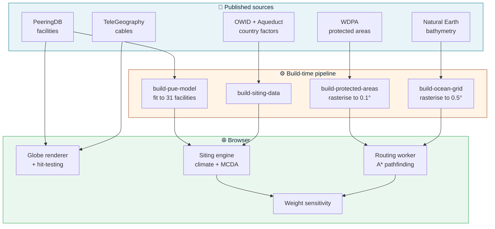
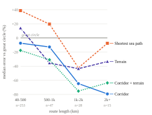

<div align="center">

# 🌊 Subsea Cable Routing & Data Centre Planning 

**An interactive planning tool for submarine cable routing and data centre siting — built on published infrastructure data, with every number traceable to its source.**

[](https://react.dev)
[](https://www.typescriptlang.org)
[](https://vite.dev)
[](#-testing)
[](#-data-provenance)
[](LICENSE)

</div>

---

## What it does

Two connected questions a real infrastructure project has to answer:

> **Where should a data centre go?** — and — **How would it connect?**

The tool renders the actual global submarine cable network, evaluates candidate sites against measured climate, national water stress and grid carbon, ranks several sites against each other, and computes hypothetical new cable routes using pathfinding over a bathymetric grid.

Its distinguishing feature is not the globe. It is that **every figure is labelled with where it came from**, and a criterion with no data behind it is reported as unavailable rather than scored as zero.

---

## 📊 At a glance

<div align="center">

| | | | |
|:--:|:--:|:--:|:--:|
| **724** | **1,920** | **5,260** | **216** |
| cable systems | landing points | facilities | countries scored |
| **702** | **412** | **292** | **0.5°** |
| protected areas | as-laid route corpus | tests passing | ocean grid |

</div>

---

## ✨ Capabilities

### 🗺️ Explore the real network
Every cable system, landing point and facility on a 3D globe. Click a cable for its landing points, owners, the company that built it and the year it entered service. Custom screen-space hit-testing gives reliable clicking where the renderer's own raycasting cannot.

### 📍 Evaluate one site
Enter a location and the tool pulls **a full year of hourly reanalysis temperature**, derives how much of the year outside air alone can carry the cooling load, joins national water stress and grid carbon intensity, and recommends a cooling configuration with a climate-adjusted PUE estimate.

### ⚖️ Compare several sites
The question siting actually starts from is *which of these*. Up to six candidates ranked on weighted criteria, re-ranking instantly because the site data is already gathered. Give a destination and every site is **routed to it**: the cable each would need, and the round-trip time it allows, are ranked alongside climate, water, carbon and connectivity.

> **A criterion missing for _any_ site is dropped for _all_ of them.** Scoring only the sites that have a value would rank a site higher precisely because less is known about it — and the table would still look complete.

### 🧭 Route a hypothetical cable
A\* search over a bathymetric grid produces materially different candidates — shortest, depth-favouring, diversity-seeking — analysed for seabed difficulty, protected-area exposure, **exposure to fishing and anchoring** (the cause of most cable faults) and separation from existing corridors, then ranked with a written justification. Like real systems, routes cross **Egypt and Panama over land** rather than sailing round Africa or South America.

### 🤝 See who is already there
For each end of a planned link: the companies that own the cables landing there, who built them, and the data-centre operators nearby — with the owners present at **both** ends picked out as the likeliest partners.

### 🧩 One decision, not two
The planner ends in a single summary: the facility design, the new cable it needs, the round-trip time, the cable estimate, what already lands nearby and who is at both ends. The site's measured climate also shapes the design — cooling the climate cannot support is left out, with the reason given.

### 🎚️ See how much the answer depends on your weights
Every ranking reports the share of possible weightings under which the recommendation still holds, and names the exact setting at which it flips.

> A result that survives every weighting and one that flips on a single slider look identical in most tools. Here they read differently.

---

## 🔍 Data provenance

Nothing is presented without its standing. This is enforced in the type system — a metric with no provenance entry cannot be rendered.

| Quantity | Source | Standing |
|---|---|:--:|
| Cable geometry, landing points | TeleGeography-derived | `REAL` |
| Data centre facilities | [PeeringDB](https://www.peeringdb.com) | `REAL` |
| Grid carbon intensity | [Our World in Data](https://ourworldindata.org) | `REAL` |
| Water stress | [WRI Aqueduct](https://www.wri.org/aqueduct) | `REAL` |
| Marine protected areas | WDPA via [EMODnet](https://emodnet.ec.europa.eu) *(European extract)* | `REAL` |
| Cable owners, builders, service year | TeleGeography Submarine Cable Map, per-cable records *(CC BY-NC-SA 3.0)* | `REAL` |
| Fishing and cargo/tanker traffic | EMODnet vessel density, AIS 2024 *(European waters, CC BY 4.0)* | `DERIVED` |
| Free-cooling hours | ERA5 reanalysis via [Open-Meteo](https://open-meteo.com) | `DERIVED` |
| Seabed depth | [NOAA NCEI](https://www.ncei.noaa.gov) global DEM mosaic, 0.5° | `DERIVED` |
| Land/water mask | Natural Earth coastline + 14 strait corrections | `DERIVED` |
| Climate-adjusted PUE | Fitted to **31 measured facility-years** | `MODELLED` |
| Route cost estimate | Assumed coefficients | `MODELLED` |

The [study](#-research) draws on a separate, higher-fidelity set — the app's schematic cable geometry cannot support claims about where a cable actually goes:

| Quantity | Source | Note |
|---|---|---|
| As-laid cable routes | [EMODnet Human Activities](https://emodnet.ec.europa.eu/en/human-activities) — seven national hydrographic offices | 89–3,369 vertices per 1,000 km, against TeleGeography's 7.3 |
| Bathymetry, 460 m | [EMODnet Bathymetry DTM](https://emodnet.ec.europa.eu/en/bathymetry) | native 1/16′; downsampling validated before use |
| Bathymetry, 1.85 km global | [NOAA NCEI](https://www.ncei.noaa.gov) DEM mosaic | a multi-source composite, **not** GEBCO |
| Fishing effort | EMODnet vessel density (AIS, fishing subset, 2022) | ~1.7 km native |

> **A defect worth knowing about if you use EMODnet Bathymetry.** It encodes out-of-coverage as exactly `0`, not as a nodata sentinel — 4.85% of the cells we built, with 36 tiles entirely zero. Since depth reads as null for any elevation ≥ 0, those cells read as **land**, and a router will confidently route around open ocean. Found while building the long-haul grid; documented in the study and back-filled from NOAA.

---

## 🏗️ Architecture



Routing runs in a **Web Worker** so pathfinding never blocks the UI. Bathymetry, protected areas and country factors are rasterised or indexed at build time, turning runtime queries into array lookups.

---

## 🔬 Research

The repository includes an original study testing an assumption behind least-cost-path cable routing tools: **do submarine cables actually avoid difficult seabed?**

Run against a **412-route as-laid corpus (206,175 km)** from seven national hydrographic offices — **355 of them matched to 460 m bathymetry** — and extended to every length band up to 6,400 km on a 1.85 km grid.

<div align="center">

</div>

<div align="center">

| Finding | Result |
|---|---|
| 🟡 Cables prefer flatter seabed | Real, replicated — but **small** (−1.65 percentile) |
| 🔴 Effect scales with terrain difficulty | **Not supported** — confounded with data source |
| 🟢 Cables follow *other cables* | **29% closer** than displaced controls, 74% of routes, after landfall control |
| 🟢 Corridor reuse as a router | **Only method that beats a great circle** (6.4 km vs 7.1 km) |
| 🟢 …and it strengthens with distance | Beats hand-set terrain on **15/15 routes above 2,000 km** (p = 0.0003) |
| 🟢 Survives an independent candidate set | Holds against TeleGeography's 724 systems with the 3 closest trackers removed |
| 🔴 Cables avoid fishing grounds | **No signal** — the apparent effect is landfall geometry |

</div>

**Three methodological controls, each of which changed a headline:**

- **Placebo-displaced controls** — displacing the observed route sideways and re-measuring establishes what the instrument reads when no preference exists. Without it, the depth effect would have been overstated by ~70%.
- **Discretisation control** — measuring what a grid search costs when reproducing a known answer. Without it, the study would have reported that bathymetry-aware routing is worse than a straight line, which is wrong.
- **Resolution gate** — re-running the original measurement at both grid resolutions before quoting anything from the coarser one. It retained 47% / 55% / 98% of the slope, relief and depth effects, which is why the long-haul results are a finding rather than an artefact.

And one rule that **explains its failures**: corridor following helps only when the neighbour geometry's error is small relative to the prediction's scale — monotonic across six bins, Spearman ρ = +0.656 on 348 routes.

> **What is not claimed as novel.** The displaced control is not an invention — it is the used-availability design that step-selection analysis in movement ecology has used for two decades. What is new is the transfer to *engineered linear infrastructure* and the measured consequence of omitting it. Likewise, the app's weight-robustness reporting is rank acceptability analysis, which has a name (SMAA) and a literature. Both are cited as such in the [study write-up](docs/seabed-route-preference-study.md).

### 📄 Read it

| | |
|---|---|
| Full write-up, every test and threat | [`docs/seabed-route-preference-study.md`](docs/seabed-route-preference-study.md) |

Every number in the write-up and every figure is **produced by a script in `scripts/research/` from the analysis cache**, so a figure cannot drift from the run that produced it.

---

## 🚀 Getting started

```bash
npm install
npm run dev
```

Then open the printed local URL. No API keys, no accounts, no backend — the app is fully static and every dataset is committed.

**Other commands**

```bash
npm run build      # production build
npm test           # 292 tests
npm run lint       # oxlint
```

**Reproducing the study.** Also Node only — no API key, no account. The largest result touches no bathymetry at all, so it can be checked in a couple of minutes without downloading a single tile:

```bash
node scripts/research/build-cable-corpus.mjs                 # fetch + characterise 412 routes
node scripts/research/analyse-corridor-following.mjs         # the raw corridor effect
node scripts/research/analyse-corridor-endpoint-control.mjs  # the controlled 29% figure
```

Full pipeline, runtimes and the order to run things in: [study §7](docs/seabed-route-preference-study.md#7-reproducing).

---

## 🧪 Testing

292 tests, and many assert properties of the **data** rather than the code — because that is where the hardest bugs lived.

| Suite | What it locks down |
|---|---|
| `cameraFraming` | All 724 cables frame correctly; the old code failed on 20+ |
| `oceanGridConnectivity` | Seas that must connect do; canals stay closed; Caspian stays landlocked |
| `cableHitTest` | The spatial prefilter never changes which cable a click resolves to |
| `protectedAreas` | Missing data is never reported as an absence of constraints |
| `oceanDepthGrid` | Depths are the model's, and the land/water mask is untouched cell for cell |
| `siteComparison` | A site never ranks higher for having less data |
| `hypotheticalRouting` | Degenerate route pairs detected symmetrically; re-ranking under new weights matches a full run |
| `nearestOceanCell` | The "nearest ocean cell" really is the nearest, and never one in a sealed sea |
| `cableNetwork` | Search ranks the place people type for ahead of chance substring matches |
| `landCrossings` | Europe–Asia and Caribbean–Pacific routes cross Egypt and Panama over land, never counted as sea |
| `maritimeActivity` | Busy water only counts where gear and anchors reach the seabed; no data is never "quiet" |
| `providers` | Owners at both ends are found; an inland site reads its nearest landing point |
| `designRecommendation` | Ruled-out Tiers never shape the ranking; cooling the climate cannot carry is left out |
| `connectivityAnalysis` | An inland site reports the distance to the coast, not "unavailable" |
| `facilityCalculator` | CUE uses the site's real grid carbon, and never steers the ranking |
| `environmentalRisk` | A measured protected-area result is never presented as a heuristic |
| `subseaSiteExposure` | Every real subsea site resolves to the basis its coverage allows |

---

## 📂 Project structure

```
src/
├── Globe.tsx                 3D globe, layers, hit-testing
├── cameraFraming.ts          spherical camera maths
├── cableHitTest.ts           screen-space cable picking
├── routing/                  A* engine, MCDA, sensitivity, protected areas
├── siting/                   climate, PUE, cooling, site comparison
├── design/                   planning wizard + inspectors
└── calculator/               facility sizing

scripts/
├── build-*.mjs               build-time data pipeline
└── research/                 reproducible study pipeline (30 scripts)

docs/
├── seabed-route-preference-study.md   the full study
└── figures/                           study figures (SVG, generated)

public/data/                  committed, app-ready datasets
```

---

## ⚠️ Known limitations

Stated here rather than discovered later:

- **Canals are crossed over land, as a model.** Routes may cross Egypt and Panama by a straight modelled land link between two grid cells — counted in the total distance, never as marine cable. It is not a surveyed terrestrial route. Natural straits narrower than the grid cell are corrected — 14 of them, listed in the shipped grid.
- **Fishing and anchoring data is European.** Outside EMODnet's coverage that criterion reports **unavailable**. Shipping traffic stands in for anchoring, which no dataset publishes.
- **Protected areas are European.** EMODnet serves the European extract of WDPA. Outside its extent the criterion reports **unavailable**, never "no constraints found".
- **Route costs are assumed.** The coefficients are not sourced and are labelled `MODELLED`.
- **Bathymetry is coarse.** Depths are modelled values on a 0.5° (~56 km) grid, not point soundings — and the land/water mask is a cartographic coastline, not the elevation model.
- **Not survey-grade.** This is a decision-support prototype, not a certified route survey.

---

## 📜 Licence

[Apache License 2.0](LICENSE) — permissive reuse with an explicit patent grant.
Chosen over MIT deliberately: submarine cable route generation is a
patent-active area, and Apache 2.0 grants patent rights from contributors and
terminates for anyone who litigates over them.

**The code is Apache 2.0. The data is not.** Each dataset remains under the
terms of its own source — see the [provenance table](#-data-provenance). Check
those terms before redistributing any of it, particularly for commercial use.

<div align="center">

**Built with** React · TypeScript · Vite · three.js · react-globe.gl

*Data: TeleGeography · PeeringDB · ERA5/Open-Meteo · WRI Aqueduct · Our World in Data · EMODnet · Natural Earth · NASA Blue Marble*

</div>
